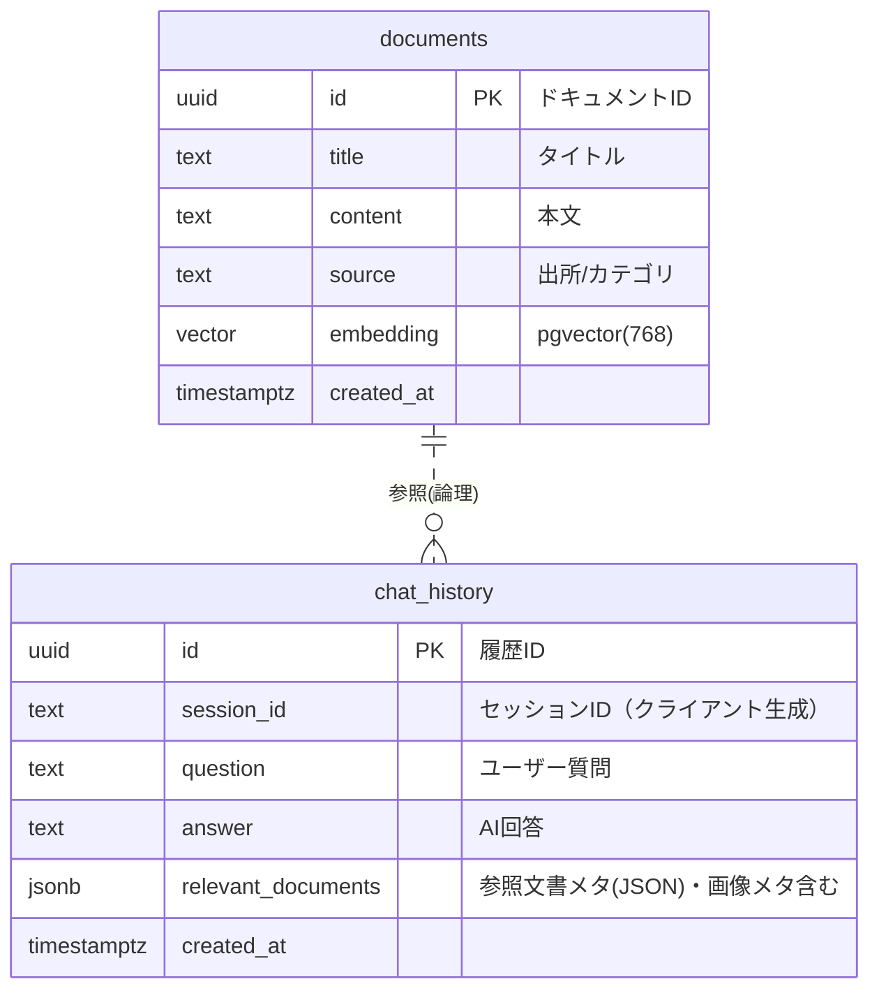

# データベース設計（ER図・DDL）

本ドキュメントは本プロジェクト（RAGチャットボット）のデータベース設計をまとめたものです。

- DB: Supabase (PostgreSQL + pgvector)
- 文字コード: UTF-8
- タイムゾーン: UTC（アプリ側でJST表記）

## ER図（Mermaid）



備考:
- `chat_history.relevant_documents` は柔軟なメタ格納のため JSONB を採用
  - 例: `[{ id, title, source, similarity }]`
  - 画像入力時は `{ images: [{ mimeType }] }` などを追加
- 物理的FK制約は課していません（RAGでは参照の疎結合と運用の柔軟性を優先）

## DDL（作成スクリプト）

```sql
-- pgvector 拡張
create extension if not exists vector;

-- 文書テーブル
create table if not exists documents (
  id uuid primary key default gen_random_uuid(),
  title text not null,
  content text not null,
  source text,
  embedding vector(768),
  created_at timestamptz default now()
);

-- チャット履歴
create table if not exists chat_history (
  id uuid primary key default gen_random_uuid(),
  session_id text not null,
  question text not null,
  answer text not null,
  relevant_documents jsonb,
  created_at timestamptz default now()
);
```

## 推奨インデックス

RAG の検索効率のため、`embedding` にベクターインデックスを作成します（近似検索・再構築コストは運用で調整）。

```sql
-- 例: IVF Flat (Postgres 16 + pgvector 0.5+)
create index if not exists documents_embedding_ivfflat
on documents using ivfflat (embedding vector_cosine_ops)
with (lists = 100);

-- テキスト検索のフォールバック用（必要に応じて）
create index if not exists documents_content_gin
on documents using gin (to_tsvector('simple', content));

-- 履歴の検索性向上
create index if not exists chat_history_session_id_idx on chat_history(session_id);
create index if not exists chat_history_created_at_idx on chat_history(created_at);
```

注意:
- `ivfflat` は事前クラスタリングのため、データ件数が増えてきたら `reindex` や lists の調整を検討
- コサイン類似度を使用（`vector_cosine_ops`）

## RPC（任意）: 類似検索 `match_documents`

プロジェクトは RPC が無くてもフォールバック動作しますが、スループット向上目的で作成を推奨します。

```sql
-- 例: 類似検索関数（必要に応じて権限付与）
create or replace function match_documents(
  query_embedding vector(768),
  match_threshold float,
  match_count int
)
returns table (
  id uuid,
  title text,
  content text,
  source text,
  similarity float
) language sql stable as $$
  select d.id, d.title, d.content, coalesce(d.source, 'unknown') as source,
         1 - (d.embedding <=> query_embedding) as similarity
  from documents d
  where d.embedding is not null
    and (1 - (d.embedding <=> query_embedding)) >= match_threshold
  order by d.embedding <-> query_embedding
  limit match_count;
$$;
```

## データ運用ポリシー（推奨）
- RLS（Row Level Security）
  - 本番ではテーブルごとにRLSを有効にし、API 経由はサービスロールキーのみで操作
- 監査
  - `chat_history` は個人情報や機密が入らないようにする（マスキング/匿名化の検討）
- 保守
  - 定期的な `embedding` 再生成ジョブ（モデル更新時）
  - `documents` の `source` はカテゴリ用途（FAQ/規程/議事録など）として運用

## サンプル `relevant_documents` 構造

```json
{
  "mode": "rag",
  "docs": [
    { "id": "uuid", "title": "勤務時間について", "source": "FAQ", "similarity": 0.87 }
  ],
  "images": [
    { "mimeType": "image/png" }
  ]
}
```

## 変更履歴
- 2025-10-05: 初版作成（チャット履歴はJSONBで参照情報を保持、画像メタも格納）
