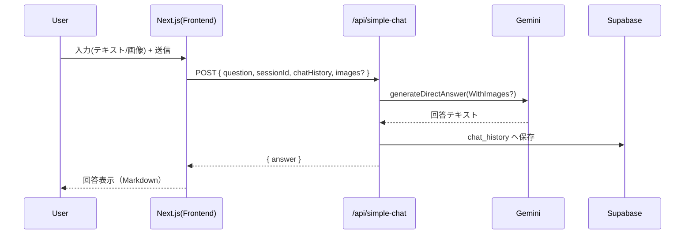
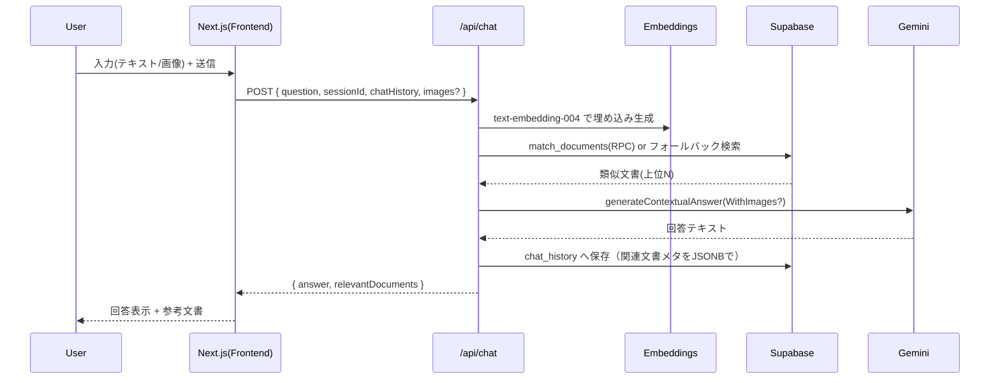
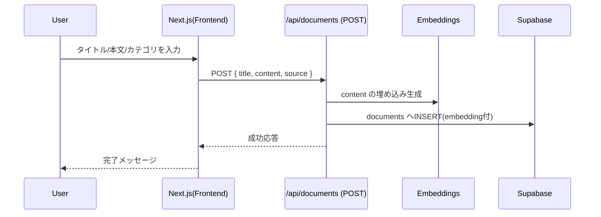

# シーケンス図 / データフロー

本ドキュメントは主要なユースケースのフローを示します（Mermaid）。

## 通常チャット（direct）

```mermaid
sequenceDiagram
  participant U as User
  participant UI as Next.js(Frontend)
  participant API as /api/simple-chat
  participant LLM as Gemini
  participant DB as Supabase

  U->>UI: 入力(テキスト/画像) + 送信
  UI->>API: POST { question, sessionId, chatHistory, images? }
  API->>LLM: generateDirectAnswer(WithImages?)
  LLM-->>API: 回答テキスト
  API->>DB: chat_history へ保存
  API-->>UI: { answer }
  UI-->>U: 回答表示（Markdown）
```

## RAG チャット

```mermaid
sequenceDiagram
  participant U as User
  participant UI as Next.js(Frontend)
  participant API as /api/chat
  participant EMB as Embeddings
  participant DB as Supabase
  participant LLM as Gemini

  U->>UI: 入力(テキスト/画像) + 送信
  UI->>API: POST { question, sessionId, chatHistory, images? }
  API->>EMB: text-embedding-004 で埋め込み生成
  API->>DB: match_documents(RPC) or フォールバック検索
  DB-->>API: 類似文書(上位N)
  API->>LLM: generateContextualAnswer(WithImages?)
  LLM-->>API: 回答テキスト
  API->>DB: chat_history へ保存（関連文書メタをJSONBで）
  API-->>UI: { answer, relevantDocuments }
  UI-->>U: 回答表示 + 参考文書
```

## 文書アップロード

```mermaid
sequenceDiagram
  participant U as User
  participant UI as Next.js(Frontend)
  participant API as /api/documents (POST)
  participant EMB as Embeddings
  participant DB as Supabase

  U->>UI: タイトル/本文/カテゴリを入力
  UI->>API: POST { title, content, source }
  API->>EMB: content の埋め込み生成
  API->>DB: documents へINSERT(embedding付)
  API-->>UI: 成功応答
  UI-->>U: 完了メッセージ
```
